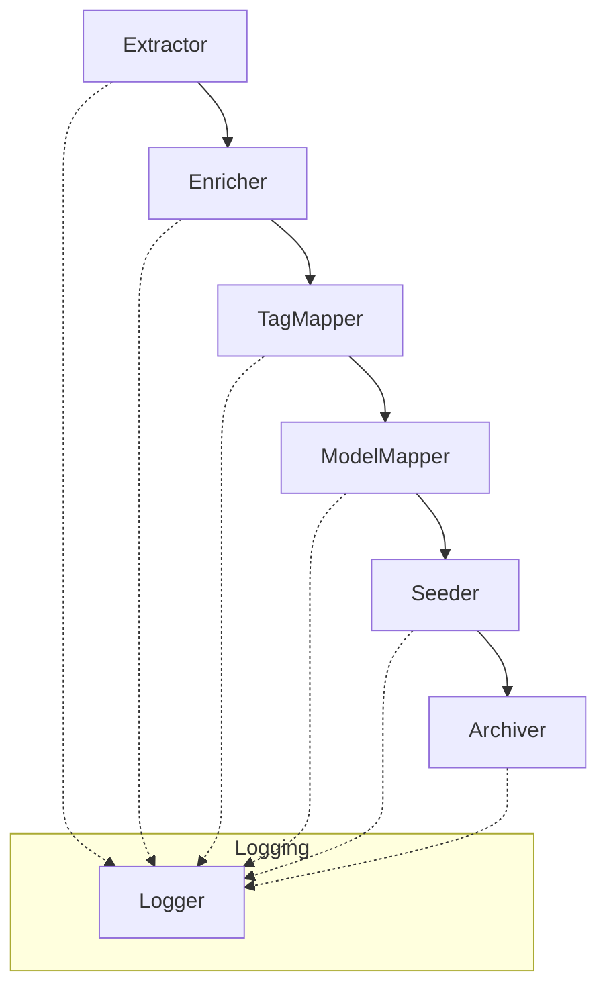

# SOLID Principles Application Plan for AI Model Seeding Pipeline

---

## Phased Refactoring Plan

### **Phase 1: Folder Structure & System Design**

#### Folder Structure

- **/pipeline/**
  - `extractor.py` (Extractor base class + implementations)
  - `enricher.py` (Enricher base class + implementations)
  - `tag_mapper.py` (TagMapper base class + implementations)
  - `model_mapper.py` (ModelMapper base class + implementations)
  - `seeder.py` (Seeder base class + implementations)
  - `archiver.py` (Archiver base class + implementations)
  - `logger.py` (Logger interface/implementation)
  - `interfaces.py` (All interfaces/abstract base classes)
  - `pipeline.py` (Orchestrates the workflow, wires up dependencies)
- **/data/**
  - `raw/` (Extracted raw model data)
  - `enriched/` (Enriched model data)
  - `processed/` (Processed/mapped data, if needed)
  - `mapped/` (API-ready payloads)
- **/archive/**
  - (Archived files after successful seeding)
- **/scripts/**
  - Thin CLI wrappers that invoke the pipeline with the right configuration.

#### System Design (High-Level)

- Each component is a class/module with a single responsibility.
- The pipeline orchestrator wires up the components and manages the workflow.
- Logger is injected into each phase for traceability.
- New sources, enrichment strategies, or seeding targets can be added by subclassing and configuration.

---

### **Phase 2: Explicit Step-by-Step System Design**

#### **Step 1: Extraction**
- **Folder:** `/data/raw/`
- **Class:** `Extractor` (in `extractor.py`)
- **Function:** `extract_models()`
  - **Behavior:** Connects to model sources (e.g., Ollama API), fetches raw model data, saves each model as a JSON file in `/data/raw/`.
  - **File Handling:** Each new model creates a file named `<model_name>_raw.json`.
  - **Logging:** Every extraction is logged (success/failure, file path).

#### **Step 2: Enrichment**
- **Folder:** `/data/enriched/`
- **Class:** `Enricher` (in `enricher.py`)
- **Function:** `enrich_models()`
  - **Behavior:** Reads each file from `/data/raw/`, adds metadata (e.g., Hugging Face info), writes enriched JSON to `/data/enriched/`.
  - **File Handling:** Input: `<model_name>_raw.json`; Output: `<model_name>_enriched.json`.
  - **Logging:** Enrichment actions and warnings/errors are logged.

#### **Step 3: Tag Mapping**
- **Folder:** `/data/enriched/` (input), `/Tags/` (tag files)
- **Class:** `TagMapper` (in `tag_mapper.py`)
- **Function:** `map_tags()`
  - **Behavior:** Reads enriched models, maps tags using `/Tags/created_tag_ids.json`, updates tag fields in model JSON.
  - **File Handling:** Updates in-place or writes to `/data/enriched/` as `<model_name>_tagged.json`.
  - **Logging:** Tag mapping actions, missing tags, and results are logged.

#### **Step 4: Model Mapping**
- **Folder:** `/data/enriched/` (input), `/data/mapped/` (output)
- **Class:** `ModelMapper` (in `model_mapper.py`)
- **Function:** `map_to_api_schema()`
  - **Behavior:** Reads tagged/enriched models, validates and transforms to API schema, writes to `/data/mapped/` as `<model_name>_api_payload.json`.
  - **File Handling:** Input: `<model_name>_tagged.json` or `<model_name>_enriched.json`; Output: `<model_name>_api_payload.json`.
  - **Logging:** Mapping actions, validation warnings/errors are logged.

#### **Step 5: Seeding**
- **Folder:** `/data/mapped/` (input)
- **Class:** `Seeder` (in `seeder.py`)
- **Function:** `seed_models()`
  - **Behavior:** Reads API payloads, sends to backend API, logs results.
  - **File Handling:** Input: `<model_name>_api_payload.json`.
  - **Logging:** Seeding attempts, API responses, and errors are logged.

#### **Step 6: Archiving**
- **Folder:** `/archive/`
- **Class:** `Archiver` (in `archiver.py`)
- **Function:** `archive_file()`
  - **Behavior:** Moves successfully seeded files from `/data/mapped/` to `/archive/`.
  - **File Handling:** Input: `<model_name>_api_payload.json`; Output: same file in `/archive/`.
  - **Logging:** Archive actions and file moves are logged.

#### **Step 7: Logging**
- **Class:** `Logger` (in `logger.py`)
- **Function:** `log_event()`
  - **Behavior:** Centralized logging for all pipeline phases, supports info, warning, error levels, and file/console output.

#### **Step 8: Orchestration**
- **Class:** `Pipeline` (in `pipeline.py`)
- **Function:** `run()`
  - **Behavior:** Wires up all components, manages the end-to-end workflow, handles dependency injection, and error propagation.

---

**Every file, function, and responsibility is explicitly defined. No step is left to chance.**

---

## 1. Single Responsibility Principle (SRP)
- Each class/module/script should have one clear responsibility.
- Split monolithic scripts into modules: Extraction, Enrichment, Tag Mapping, Mapping, Seeding, Archiving, Logging.
- Each module should only handle its phase (e.g., `Extractor`, `Enricher`, `TagMapper`, `ModelMapper`, `Seeder`, `Archiver`, `Logger`).

## 2. Open/Closed Principle (OCP)
- Modules/classes should be open for extension, closed for modification.
- Use base classes or interfaces for each phase (e.g., `BaseExtractor`, `BaseEnricher`).
- Allow new data sources, enrichment strategies, or seeding targets to be added by subclassing, not by editing core logic.
- Use configuration or dependency injection for source/target selection.

## 3. Liskov Substitution Principle (LSP)
- Subclasses should be usable anywhere their parent class/interface is expected.
- Define clear interfaces for each phase (e.g., `IExtractor`, `IEnricher`, `ISeeder`).
- Ensure all implementations of an interface/class can be swapped without breaking the pipeline.

## 4. Interface Segregation Principle (ISP)
- Prefer many small, specific interfaces over large, general ones.
- Break down large interfaces into focused ones (e.g., `IModelReader`, `IModelWriter`, `ITagMapper`).
- Consumers depend only on the methods they actually use.

## 5. Dependency Inversion Principle (DIP)
- Depend on abstractions, not concrete implementations.
- Use dependency injection to provide concrete implementations of extractors, enrichers, mappers, etc.
- Main pipeline logic should work with interfaces/abstract classes, not specific implementations.
- Facilitate testing and extension by swapping out components.

---

## Proposed High-Level Structure

- **/pipeline/**
  - `extractor.py` (Extractor base class + implementations)
  - `enricher.py` (Enricher base class + implementations)
  - `tag_mapper.py` (TagMapper base class + implementations)
  - `model_mapper.py` (ModelMapper base class + implementations)
  - `seeder.py` (Seeder base class + implementations)
  - `archiver.py` (Archiver base class + implementations)
  - `logger.py` (Logger interface/implementation)
  - `interfaces.py` (All interfaces/abstract base classes)
  - `pipeline.py` (Orchestrates the workflow, wires up dependencies)
- **/scripts/**
  - Thin CLI wrappers that invoke the pipeline with the right configuration.

---

## Next Steps

1. Define interfaces/abstract base classes for each phase.
2. Refactor each script into a class/module that implements the relevant interface.
3. Create a pipeline orchestrator that wires up the phases using dependency injection.
4. Update CLI scripts to use the orchestrator.
5. Write tests for each component using mocks for dependencies.
