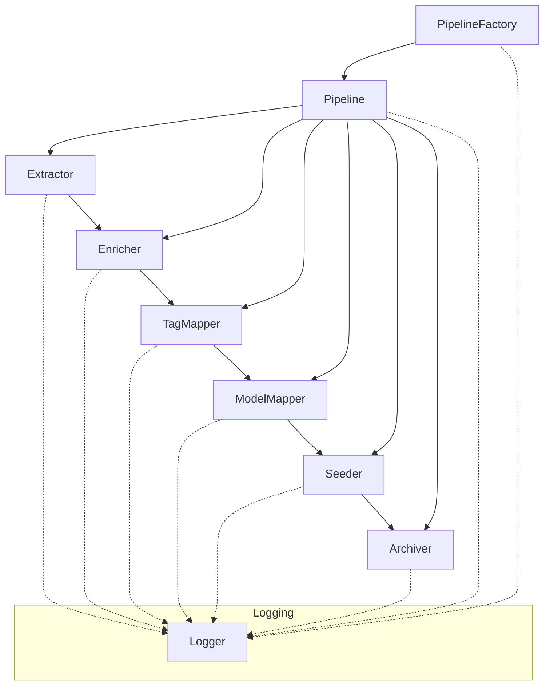

# System Patterns

## System Architecture
- SOLID-based Python pipeline with clear interfaces (`interfaces.py`)
- Base classes providing common functionality (`base.py`)
- Concrete implementations for each pipeline phase
- Factory pattern for component creation (`factory.py`)
- Pipeline orchestrator for workflow management (`pipeline.py`)
- Configuration management through centralized config (`config.py`)
- JSON files as the primary data interchange and storage format

## Key Technical Decisions
- Python for its ecosystem and flexibility
- Interface segregation through abstract base classes
- Dependency injection for loose coupling and testability
- Template method pattern for phase-specific implementations
- JSON for human-readable, extensible data storage
- Structured logging with context-aware formatting

## Design Patterns
- Factory Pattern: `PipelineFactory` for creating pipeline components
- Strategy Pattern: Interchangeable components (extractors, enrichers, etc.)
- Dependency Injection: Components receive their dependencies in constructor
- Template Method: Base classes define workflow, subclasses implement specifics
- Adapter Pattern: Different sources adapted to common pipeline format
- ETL (Extract, Transform, Load) workflow with discrete phases

## Component Relationships

- Each component implements a specific interface
- Components are stateless and reusable
- Pipeline orchestrator manages data flow between phases
- Factory creates and configures components dynamically
- Logger provides consistent traceability across all components 