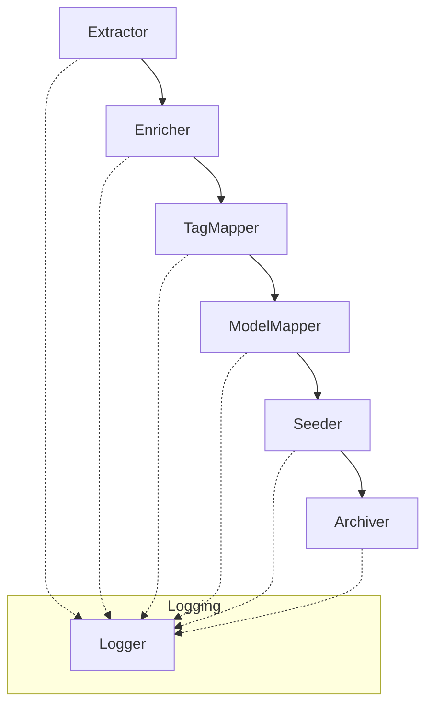

# System Patterns

## System Architecture
- SOLID-based Python pipeline for data extraction, transformation, and management
- Component-based design with well-defined interfaces and abstractions
- Clear separation of concerns across pipeline phases
- JSON files as the primary data interchange and storage format
- Improved directory structure organized by pipeline phase

## Key Technical Decisions
- Use of Python for scripting due to its ecosystem and flexibility
- Application of SOLID principles for maintainable, extensible code
- Dependency injection for loose coupling and testability
- JSON for human-readable, extensible data storage
- Comprehensive logging and traceability throughout the pipeline

## Design Patterns
- Abstract Factory for creating pipeline components
- Strategy Pattern for interchangeable algorithms (extractors, enrichers, etc.)
- Dependency Injection for component wiring
- Template Method for defining skeleton of pipeline phases
- Observer Pattern for logging events across components
- ETL (Extract, Transform, Load) workflow with discrete phases

## Component Relationships

- Each component is a class/module with a single responsibility
- Components interact through well-defined interfaces
- Pipeline orchestrator wires up the components and manages workflow
- Logger is injected into each phase for traceability 